# cabineteer

[](https://github.com/chemrich/cabineteer/actions/workflows/ci.yml)
[](LICENSE)


**Shop-ready cabinet paperwork without CAD.** Say what you want in plain English; get a validated 3D design, optimized cut sheets, sheet layouts, a priced hardware list with real part numbers, and Domino mortise maps — where every number comes from code, not a chatbot's guess.

The AI is only the interface. Every millimetre comes from a deterministic engine that runs **on your own machine** and knows real slide clearances, hinge boring positions, joinery offsets, and sheet sizes.

**Frameless / Euro casework** — cabinets, dressers, consoles, benches, bookcases. *Not* face frames, CNC toolpaths, curves, or photoreal renders.

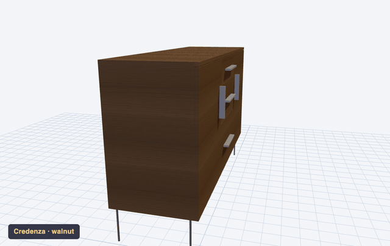

*Nine furniture types — credenza, dresser, tall chest, nightstand, media console, bar cabinet, open shelving, console table, wardrobe — each a real cabineteer design in walnut, white oak, or birch. Every image in this README came from a real project that produced real cut sheets.*

## What it is — and what it is not

cabineteer designs **rectilinear frameless casework** extremely well: carcasses, drawers, doors, the hardware that hangs them, and every piece of paper you need to cut and glue them up. It was built alongside real projects — a dining-room sideboard run, a miter-saw station, kids' desks, a printer pedestal — and its outputs have been taped to a real table saw.

It is **not** a CNC/CAM tool (no toolpaths, no DXF nesting export), a face-frame designer (frameless/Euro construction only), or a photorealistic renderer. It doesn't do curved work, chairs, or timber framing, and it doesn't pretend to.

## What you get out of a design session

1. **A validated design.** Every configuration runs through the evaluator, which returns *graded issues with the measured value and the limit* — not just "invalid."
2. **An interactive 3D preview.** One self-contained HTML file you open in any browser. Slide every drawer open, x-ray the fronts, cut a section plane, switch wood finishes live.
3. **Cut sheets you can take to the saw.** Consolidated cutlist with part IDs, guillotine sheet layouts with numbered breakdown cuts, dimensions in bold metric *and* fractional inches to 1/32″, HTML and PDF.
4. **A hardware shopping list with real part numbers.** Blum, Accuride, Salice, Richelieu — orderable numbers, pack-quantity math ("5 pulls → 3 IKEA 2-packs → 1 leftover"), and list-price totals (snapshots — verify at your supplier).
5. **Assembly instructions.** A per-panel carcass glue-up plan: which joints go where, Domino mortise positions from the front edge, machine setup values, a dry-fit step before any glue.

And it's not marketing — here is the evaluator's actual output on a cabinet whose drawer opening is too short for its slides:

```
$ cabineteer-cli evaluate my-vanity        # or just tell your assistant: "evaluate it"
{
  "summary": { "errors": 1, "warnings": 0, "pass": false },
  "issues": [
    { "severity": "error", "check": "hardware_clearance",
      "message": "Drawer height 34.0mm < minimum 68mm for Blum Tandem 550H" }
  ]
}
```

…and a few rows of a real cutlist (the `Notes` column carries the build detail — here, a back-capping top):

```
ID   Name     L(mm)   W(mm)   T   Qty  Material       Notes
S1   side     408     330.0   18   4   baltic_birch
T1   top      355.6   330.0   18   2   baltic_birch   full depth — rear edge flush with sides, caps the back
B1   bottom   355.6   324.0   18   2   baltic_birch
SH1  shelf_1  355.6   324.0   18   2   baltic_birch
```

## How it works, in one breath

You type what you want into an everyday chat app — the way you'd text a sketch to a buddy. cabineteer is the shop assistant plugged into that chat: it does the clearance math, draws the 3D model, and prints the cut sheets and shopping list. *You* make every design call; it does the arithmetic and the paperwork. (MCP — the standard those chat apps use to run local tools — is the only bit of plumbing, and the [Quick start](#quick-start) sets it up once.) Prefer no chat at all? Drive the same engine from the [command line or Python](#three-ways-to-drive-it).

**Your data.** The engine — all dimensional math, evaluation, cut sheets, hardware BOMs, 3D previews, assembly docs — is deterministic Python that runs entirely on your machine and makes no network calls. It sends no telemetry. The only thing that ever leaves your computer is the chat you type, and it goes only to whichever AI provider *your own* client is configured to use — cabineteer embeds no vendor and never uploads your designs. Every saved project is a plain JSON file under `~/.cabineteer/` that stays there until you move or delete it. Want zero network? Use the CLI or the library — fully offline.

## Can I trust the numbers?

The fear with any "AI CAD" tool is plausible-but-wrong output. cabineteer is built so the AI *can't* inject a dimension: it picks which tool to call and with what parameters, and the geometry is computed by pure-Python dataclasses the model never touches.

> **Where a number comes from — one drawer, end to end.**
> You ask for a 600 mm cabinet with a single 60 mm drawer opening on Blum Tandem 550H slides.
> - The 550H datasheet fixes the clearances the box must give up top and bottom → the engine computes a **34 mm** drawer-box height.
> - The same datasheet sets the slide's **68 mm** minimum drawer height.
> - The evaluator flags it: `error — Drawer height 34.0mm < minimum 68mm for Blum Tandem 550H`, and the design does not pass.
> - The eval scenario `drawer_carcass_clearances_short_opening` pins exactly this outcome, so the number can't silently change.
>
> Not one step in that chain is the AI's opinion.

Issues carry the measured value against the limit, so you can act on them at the bench:

```
{ "severity": "warning", "check": "door_overlay_collision", "value": 17.5, "limit": 16.0,
  "message": "column 2: door overlay 9.5 mm leaves only 0.5 mm reveal on the 18 mm interior
              divider — use the hinge's side adjustment (±2 mm) to open the reveal." }
```

**Verify it yourself** — no chat window required:

```bash
uv run python -m evals                       # <!--stat:scenarios-->307<!--/stat:scenarios--> scenarios / <!--stat:assertions-->1,168<!--/stat:assertions--> typed assertions on real output numbers
uv run python scripts/readme_stats.py --check # the counts quoted in this file, regenerated from source
python -c "from cabineteer.presets import get_preset; from cabineteer.evaluation import evaluate_cabinet, print_report; print_report(evaluate_cabinet(get_preset('kitchen_base_3_drawer').config))"
```

A hallucinated dimension would fail the eval suite — every one of those assertions checks a number the tools computed.

## Who this is for

**Cabinet makers and serious hobbyists** who want the tedious parts — clearance math, cut planning, hardware takeoffs — done instantly and correctly, while every design decision stays theirs. The defaults encode working shop practice:

- Drawer boxes default to Baltic birch with undermount-slide clearances from the manufacturer datasheets.
- Drawer bottoms upgrade themselves from 6 mm to 12 mm when a box is big enough to need it (taller than 5″ *and* wider than 16″).
- Hinge counts and cup positions follow Blum's published placement rules.
- Adjustable shelves are modeled fixed for the BOM but noted to cut 2 mm narrow for 32 mm-system pins.
- The sheet optimizer can mirror a real breakdown sequence: track-saw rips first, then cross-cuts, then table-saw rips that respect your fence capacity.

## Quick start

You need [uv](https://docs.astral.sh/uv/getting-started/installation/) (a Python manager — it handles everything, you never touch Python yourself) and an AI chat app that speaks MCP, such as [Claude Code](https://claude.com/claude-code) or [Claude Desktop](https://claude.ai/download).

```bash
git clone https://github.com/chemrich/cabineteer.git
cd cabineteer
uv sync                                              # ~2 GB, a few minutes the first time (it builds CadQuery)
claude mcp add cabineteer -- uv --directory $(pwd) run cabineteer
claude mcp list                                      # confirm: cabineteer is listed
```

> The `claude` command is **Claude Code**. On the Claude Desktop app, Gemini CLI, **Windows** (where `$(pwd)` needs a tweak), or HTTP mode — or if `uv sync` fails building CadQuery — see [docs/local-setup.md](docs/local-setup.md) (lite mode skips the heavy 3D dependency).

Then start a session with `claude` and ask (run `/mcp` first if you want to see cabineteer's tools connected):

> Design a 900 mm three-drawer kitchen base with soft-close undermount slides and a classic drawer graduation.

> Make me a bathroom vanity with two doors and an inset shelf. Soft-close hinges.

> Generate the cutlist for the workshop cabinet we just designed. My sheets are 2440 × 1220.

## Three ways to drive it

cabineteer has exactly three front ends over one engine — there is no other magic:

**1 · Your AI assistant** (the [Quick start](#quick-start) above) — the conversational path.

**2 · The command line** — the same tools from a shell, no AI, no API key:

```bash
cabineteer-cli list-tools                              # every tool the engine exposes
cabineteer-cli projects                                # your saved library
cabineteer-cli evaluate  guest-room-dresser            # graded errors/warnings
cabineteer-cli cutlist   guest-room-dresser --sheet-length 2453 --sheet-width 1234
cabineteer-cli visualize guest-room-dresser --finish rift_white_oak
cabineteer-cli run apply_preset --arg name=kitchen_base_3_drawer   # escape hatch to any tool
```

**3 · The Python library** — the whole engine is importable; script a build to files with nothing else running:

```python
from cabineteer.presets import get_preset
from cabineteer.evaluation import evaluate_cabinet, print_report

cfg = get_preset("kitchen_base_3_drawer").config
print_report(evaluate_cabinet(cfg))          # → graded issues, value vs limit
```

See [docs/architecture.md](docs/architecture.md) for the module map.

## What it knows

| Area | Depth | Docs |
|---|---|---|
| **Drawer slides** | <!--stat:slides-->10<!--/stat:slides--> models — Blum Tandem/Movento, Accuride, Salice — with clearances, load ratings, and length ranges | [hardware](docs/hardware.md) |
| **Hinges** | Blum Clip Top catalog with real orderable part numbers (71T/71B series), mounting plates, and screw callouts | [hardware](docs/hardware.md) |
| **Pulls & knobs** | <!--stat:pulls-->48<!--/stat:pulls--> entries (Top Knobs, Rockler, Richelieu, Häfele, IKEA) with placement policy and pack math | [pulls](docs/pulls.md) |
| **Drawer joinery** | Butt, locking-rabbet (QQQ), half-lap, drawer-lock — all cut dimensions computed from stock thickness | [joinery](docs/joinery.md) |
| **Carcass joinery** | Dado/rabbet, floating tenon (Domino), pocket screw, biscuit, dowel — plus mitered waterfall corners | [joinery](docs/joinery.md) |
| **Edge banding** | Iron-on hot-melt or shop-ripped hardwood banding, with core-size compensation and its own cutlist | [edge-banding](docs/edge-banding.md) |
| **Proportions** | Graduated drawer heights and column widths via named ratios (equal / subtle / classic / golden) | [proportions](docs/proportions.md) |
| **Presets** | <!--stat:presets-->26<!--/stat:presets--> pre-validated starting points: kitchen, workshop, bedroom, bathroom, office, entryway, living room | [presets](docs/presets.md) |
| **Cut planning** | Four sheet-layout algorithms incl. a shop-sequence "rips first" mode; per-material sheet sizes; part IDs | [cutlists](docs/cutlists.md) |
| **Assembly** | Carcass joint census, per-panel mortise maps, machine setup blocks, dry-fit-first step lists | [assembly](docs/assembly.md) |
| **Projects** | Multi-cabinet runs with shared design settings, saved library, delta edits, forking, batch cutlists, worktops | [projects](docs/projects.md) |
| **3D viewer** | Self-contained HTML, keyboard shortcuts, live wood finishes, section plane, diagnostics | [viewer](docs/viewer.md) |

The engine exposes <!--stat:tools-->30<!--/stat:tools--> tools in all; `cabineteer-cli list-tools` prints them.

> **One cutlist caveat, stated plainly:** cut dimensions are exact for the *butt-joint* carcass methods — floating tenon (Domino), pocket screw, biscuit, dowel — which is how cabineteer is built to work. If you pick **dado/rabbet** construction, the 3D model draws the housed panels correctly but the cutlist does **not** yet add the dado/rabbet allowances (it emits butt-joint panel sizes, which run narrow for housed joints). Use a butt method for a saw-ready cutlist, or add the housing allowances yourself.

## A tour, in prompts

One design, carried from idea to paperwork:

> **Start it.** A 44-inch armoire: two columns of three drawers with a tall door section above, classic graduation, walnut pulls.

> **Check it before you commit.** Evaluate it. — *returns graded issues, e.g. "drawer_height 87.4 mm < slide minimum 89 mm"* — then: Fix what you can automatically.

> **See it.** Visualize it in rift white oak, horizontal grain.

> **Plan the build.** Cutlist, please — 18 mm Baltic birch carcass, my oak sheets are 2453 × 1234. … Assembly instructions for the carcass; I have a DF 500.

> **Keep it.** Save this as guest-room-dresser. … Fork it as a walnut version. … Change the top drawer to 150 mm.

> **Batch the shopping.** One combined cutlist for the dresser and the hall tree — I'm buying plywood once.

Panels from both projects pack onto shared sheets for minimum waste, but each keeps its own colour on every sheet drawing, its own column in the parts list, and its own count on every hardware line.

## Vs. what you already use

Already in **SketchUp + OpenCutList**, **CutList Optimizer**, or **Fusion**? Keep them — they nest and render well, and OpenCutList is free. cabineteer owns everything *upstream* of the cutlist: it builds the parametric model, validates that every drawer clears its slide and every door clears its neighbour, and does the hardware takeoff with real part numbers — all from one sentence, before OpenCutList ever sees a panel. Change one dimension and the cutlist, the hardware BOM, the mortise map, and the assembly steps all regenerate together. That's the modeling you'd otherwise do by hand.

## Gallery

Every render below is a saved cabineteer project, not a mock-up.

| Kids' desk | Miter-saw station | Shelf trio |
|---|---|---|
| 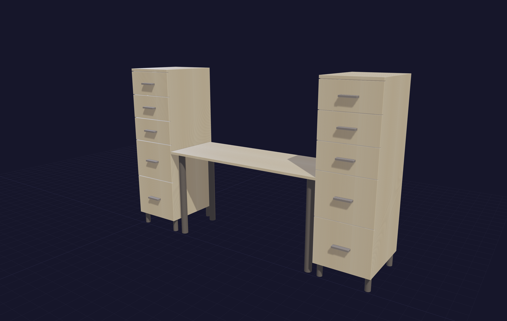 | 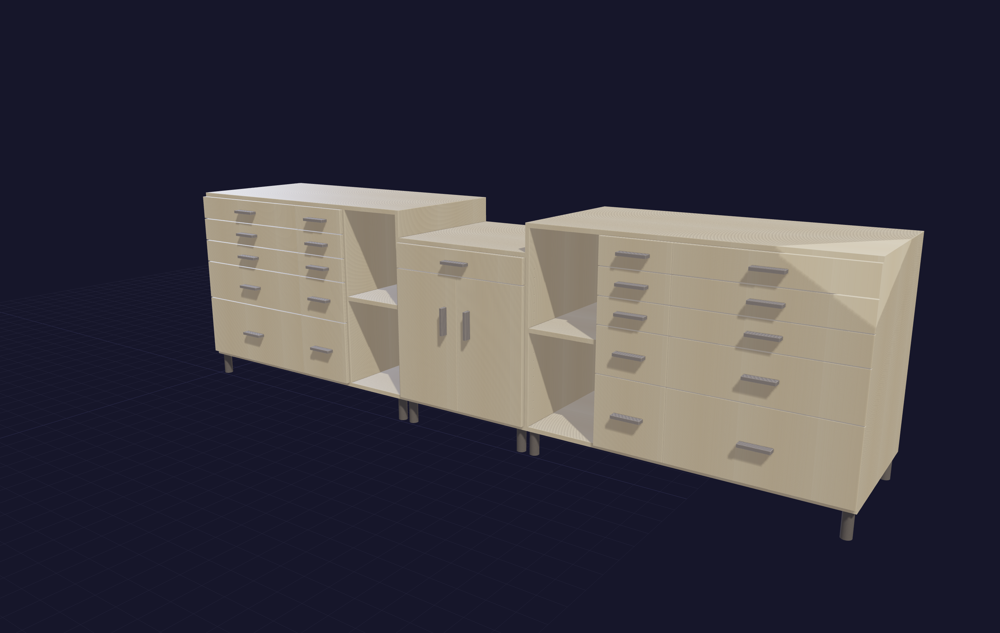 | 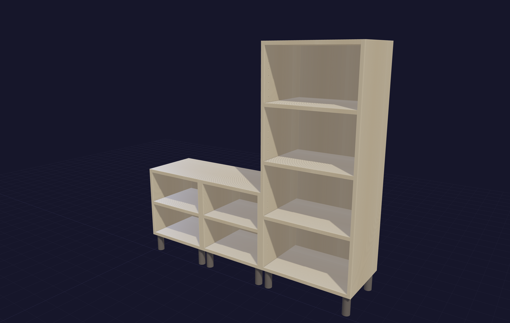 |

*Two drawer towers flanking a 48″ kneehole under one worktop; a mixed-height miter-saw station with wings; twin cubbies plus a step-tall shelf unit.*

**Same design, one line of config apart** — the identical sideboard rendered with three `finish` values. Drawer boxes stay Baltic birch throughout, as they would in the shop.

| European walnut | Rift white oak | Bamboo |
|---|---|---|
| 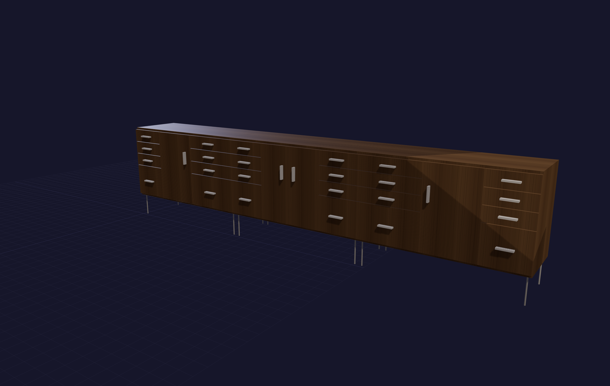 | 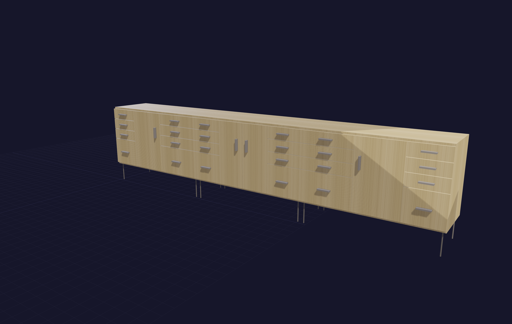 |  |

**See inside before you cut.** The viewer is a build-checking tool, not a renderer: press `X` to x-ray the fronts and confirm the boxes and slides fit, `O` to slide every drawer open, `C` to cut a section plane with a live mm readout. Keys and finishes are documented in [docs/viewer.md](docs/viewer.md).

| X-ray fronts (`X`) | Section cut (`C`) |
|---|---|
| 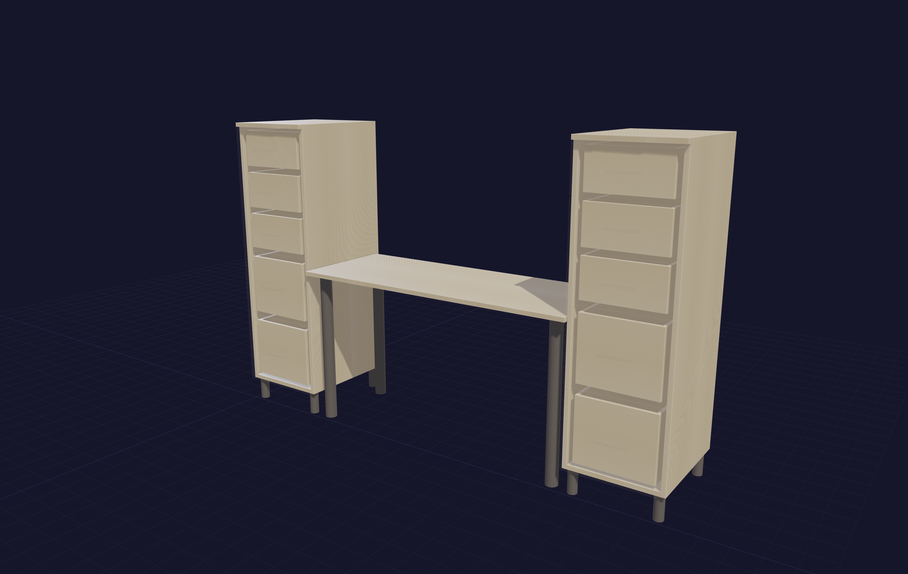 | 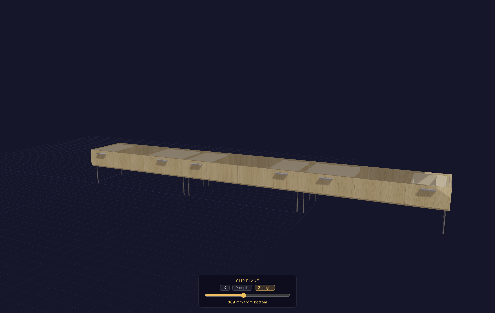 |

**The paperwork follows the design automatically** — change one dimension and every document below regenerates to match.

| Bench parts list | Mortise map | Hardware BOM |
|---|---|---|
| 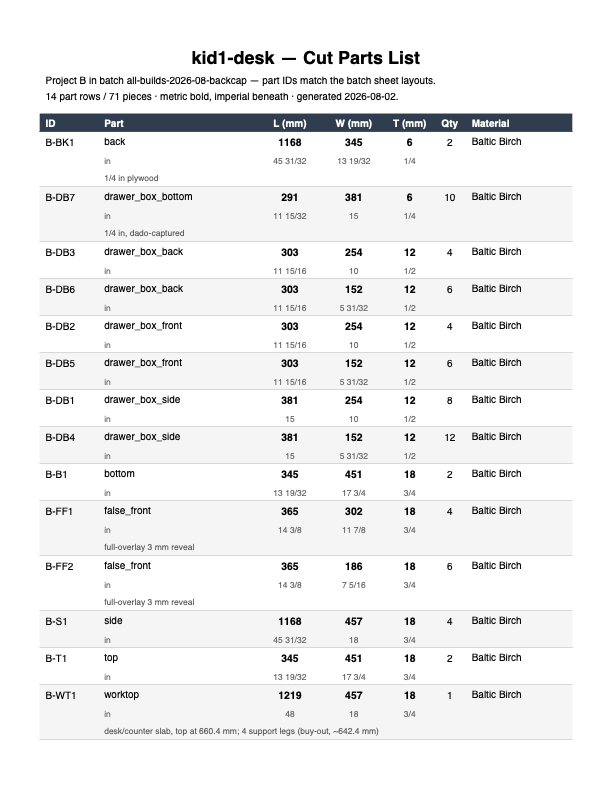 | 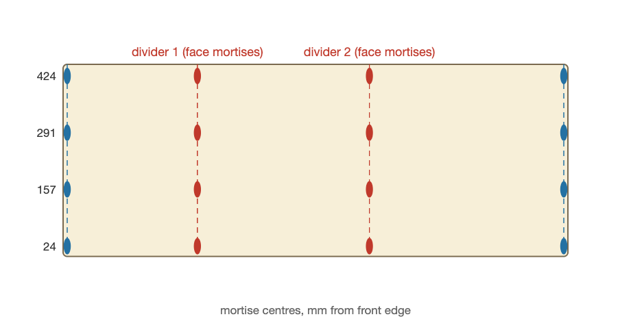 | 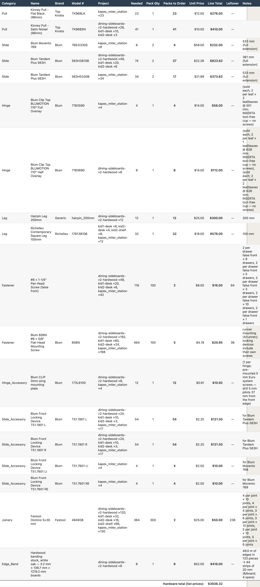 |

*A bench-format cut-parts page (bold metric, grey fractional-inch sub-rows); a bottom panel's Domino mortise map (red = face mortises, blue = edge mortises, centres from the front edge); and the batch hardware BOM with real Blum/Top Knobs/Richelieu part numbers, per-project counts, and pack math.*

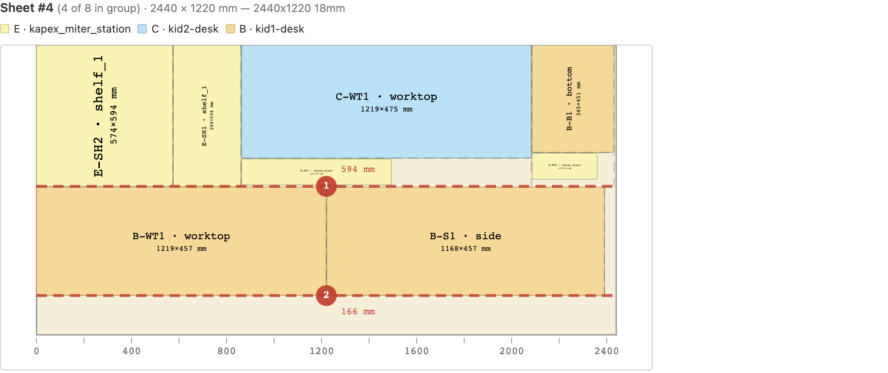

*One 2440 × 1220 sheet from a five-project batch — parts from three builds share the panel, told apart by both colour **and** a per-project letter on every part ID, with numbered dashed guillotine breakdown cuts and their dimensions.*

## Where files land

Everything durable is written under `~/.cabineteer/` — plain local files you can back up, diff, or delete; nothing is uploaded.

| Folder | Contents |
|---|---|
| `projects/` | Saved designs (JSON — the durable source of truth) |
| `cutlists/` | Cutlist HTML/PDF/CSV/JSON + sheet layout drawings + banding cutlists |
| `visualizations/` | Self-contained 3D viewer HTML files |
| `assembly/` | Carcass assembly instructions (HTML/PDF) |

## Install options

| Command | What you get |
|---|---|
| `uv sync` | **Recommended.** Everything: CadQuery (the 3D geometry engine), opcut + rectpack (sheet nesting), reportlab (PDF) |
| `uv pip install -e ".[full]"` | Same, via pip-style extras |
| `uv pip install -e .` | **Lite.** Pure-Python: design, evaluation, cutlist BOM, CLI, MCP server — no 3D, no PDF |

Lite mode exists because CadQuery is a heavy native dependency; everything except 3D geometry, interference checks, PDF export, and the advanced nesting algorithms works without it — and it's a much smaller set of dependencies to install and audit. Run lite with `uv run --no-group full cabineteer`.

## For contributors

```bash
uv run pytest tests/ -v        # 1,500+ unit + integration tests
uv run python -m evals         # <!--stat:scenarios-->307<!--/stat:scenarios--> scenarios / <!--stat:assertions-->1,168<!--/stat:assertions--> assertions, runs in ~1 second
```

The eval harness ([docs/evals.md](docs/evals.md)) drives the same tool handlers the MCP server and CLI expose, with scenarios written as natural-language prompts plus typed assertions — it's how every feature and bug fix is pinned down. Neither suite requires CadQuery. The counts above are regenerated from source by `scripts/readme_stats.py` and gated in CI, so they can't drift.

See [CONTRIBUTING.md](CONTRIBUTING.md) for the dev workflow (adding a preset, a scenario, or a hardware spec). Pre-1.0 and actively developed — the tool API may still shift, so pin your checkout. Bugs and ideas → [GitHub Issues](https://github.com/chemrich/cabineteer/issues).

## License

[Apache License 2.0](LICENSE) — free to use, modify, and distribute, including
commercially. In return you must keep the copyright and [NOTICE](NOTICE)
attribution and state any changes you make; the license also grants an explicit
patent license. See [NOTICE](NOTICE) for how to credit the project.

## Attributions

Hardware dimensions, placement rules, part numbers, and joinery references come from manufacturer datasheets and woodworking literature. See [ATTRIBUTIONS.md](ATTRIBUTIONS.md) for full citations. Prices are list/MSRP snapshots — check your supplier.
