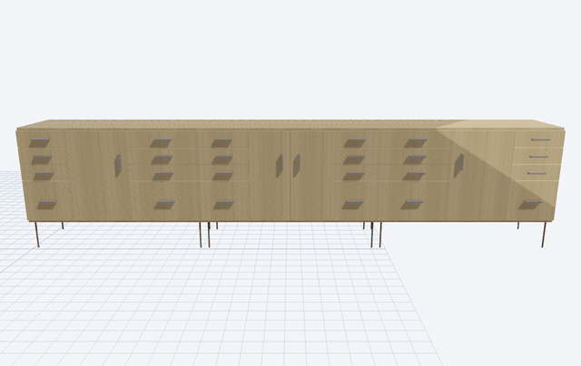
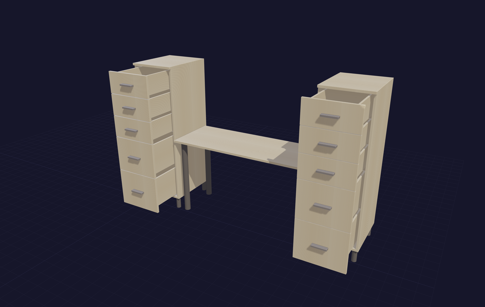
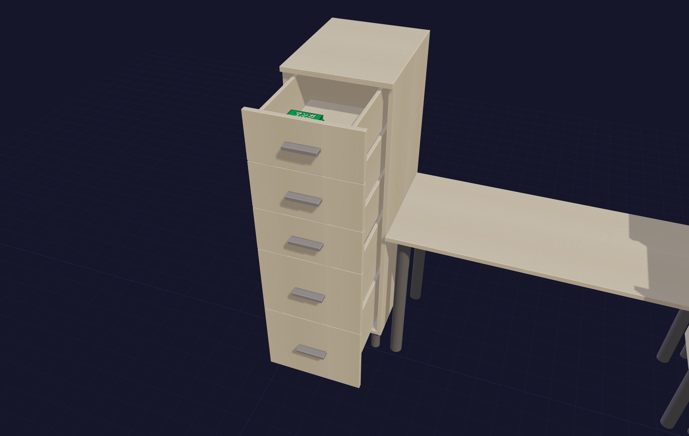
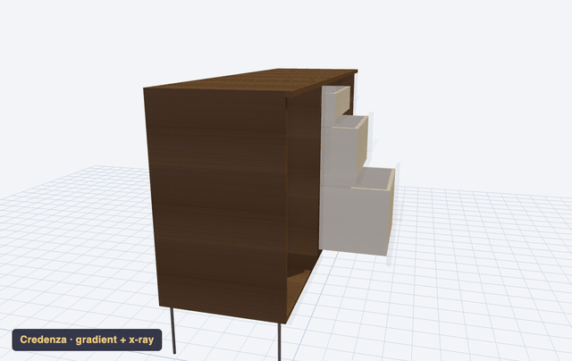
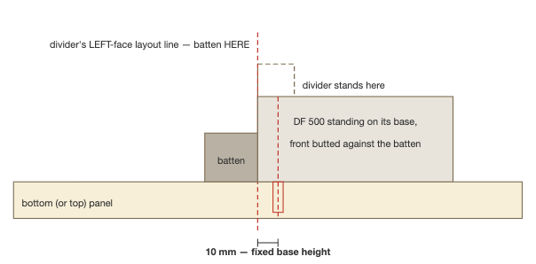

# cabineteer

**Design real, buildable cabinets and furniture by talking to an AI — and walk away with the paperwork your shop actually needs.**

Describe the piece you want in plain English. Claude (or another AI assistant) drives cabineteer's parametric engine and hands back a validated design, an interactive 3D preview, optimized cut sheets, a priced hardware shopping list with real part numbers, and step-by-step carcass assembly instructions.


*Nine distinct furniture types — credenza, dresser, tall chest, nightstand, media console, bar cabinet, open shelving, console table, wardrobe — each a real cabineteer design in walnut, white oak, or birch, with pulls, knobs, and lifted stances. Every image in this README came from a real project that produced real cut sheets.*

You don't need to be a programmer. If you can install two command-line tools and paste one line into a terminal, you can use everything here from a chat window. And the dimensional math is never left to the AI's imagination — every number comes from deterministic code that knows slide clearances, hinge boring positions, joinery offsets, and sheet sizes.

## What you get out of a design session

1. **A validated design.** Every configuration runs through dozens of checks — drawer-slide clearances, hinge overlay collisions, shelf deflection, panel geometry, joinery feasibility, pull fit — each returning a graded issue with the measured value and the limit, not just "invalid."
2. **An interactive 3D preview.** A single HTML file you open in any browser — no software to install. Slide every drawer open with one key, x-ray the fronts, cut a section plane through the carcass, and switch between eight procedural wood finishes (rift white oak, walnut, cherry, bamboo…) live.
3. **Cut sheets you can take to the saw.** Consolidated cutlist with part IDs, guillotine sheet layouts with numbered breakdown cuts, dimensions in bold metric *and* fractional inches to 1/32″, printable HTML and PDF.
4. **A hardware shopping list with real SKUs.** Blum, Accuride, Salice, Richelieu — orderable part numbers, pack-quantity math ("5 pulls needed → 3 IKEA 2-packs → 1 leftover"), and list-price totals per line and per project.
5. **Assembly instructions.** A printable, per-panel plan for carcass glue-up: which joints go where, Domino mortise positions measured from the front edge, machine setup values, a dry-fit step before any glue, and edge-banding steps in the right order.


*One 2440 × 1220 sheet from a five-project batch — parts from three different builds share the panel, colour-coded per project with lettered part IDs, and the numbered dashed lines are the guillotine breakdown cuts with their dimensions.*

## Gallery

### One engine, many pieces

Every render below is a saved cabineteer project, not a mock-up.

| Kids' desk | Miter-saw station | Shelf trio |
|---|---|---|
|  |  |  |

*Left to right: two drawer towers flanking a 48″ kneehole under one worktop; a mixed-height miter-saw station with wings; twin cubbies plus a step-tall shelf unit.*

### Same design, one line of config apart

| European walnut | Rift white oak | Bamboo |
|---|---|---|
|  |  |  |

*The identical sideboard project rendered with three `finish` values. Drawer boxes stay Baltic birch throughout — as they would in the shop.*



*…or switch finishes live in the viewer — rift oak → walnut → bamboo → cherry — on one continuously revolving design.*

### See inside before you cut

| | |
|---|---|
|  |  |
| *`X` — x-ray the fronts to check boxes and slides* | *`O` — every drawer slides open, faces and pulls along* |
|  |  |
| *`C` — clip plane with live mm readout* | *`M` — a manga stack in the drawer answers "how big is it really?"* |



*`O` then `X` together: drawers cascade open in a bottom-heavy gradient while the fronts turn transparent — the Baltic-birch boxes you'll actually build, visible in place.*

### The paperwork follows the design automatically

Change one dimension and every document below regenerates to match.

| Bench parts list | Mortise map | Registration drawing |
|---|---|---|
|  |  |  |

*A bench-format cut parts page (bold metric, grey fractional-inch sub-rows); a bottom panel's Domino mortise map — red rows are face mortises, blue are edge mortises, centres measured from the front edge; and the machine-setup cross-section showing the one 10 mm registration reference every mortise shares.*


*The batch hardware BOM: real Blum/Top Knobs/Richelieu part numbers, per-project piece counts, pack-quantity math, and list-price totals — ready to paste into an order.*

## Quick start

You need [uv](https://docs.astral.sh/uv/getting-started/installation/) (a Python manager — it handles everything, you never touch Python yourself) and an MCP-capable AI client such as [Claude Code](https://claude.com/claude-code) or [Claude Desktop](https://claude.ai/download).

```bash
git clone https://github.com/chemrich/cabineteer.git
cd cabineteer
uv sync
claude mcp add cabineteer -- uv --directory $(pwd) run cabineteer
```

Then just ask:

> Design a 900 mm three-drawer kitchen base with soft-close undermount slides and a classic drawer graduation.

> Make me a bathroom vanity with two doors and an inset shelf. Soft-close hinges.

> I want a sideboard like the one in this photo — three bays, drawers flanking a door pair.

> Generate the cutlist for the workshop cabinet we just designed. My sheets are 2440 × 1220.

For Claude Desktop, Gemini CLI, HTTP mode, and troubleshooting, see [docs/local-setup.md](docs/local-setup.md).

## Who this is for

**Cabinet makers and serious hobbyists** who want the tedious parts — clearance math, cut planning, hardware takeoffs — done instantly and correctly, while every design decision stays theirs. cabineteer was built alongside real projects (a dining-room sideboard run, a miter-saw station, kids' desks, a printer pedestal) and its outputs have been taped to a real table saw. The defaults encode working shop practice:

- Drawer boxes default to Baltic birch with undermount-slide clearances from the manufacturer datasheets.
- Drawer bottoms upgrade themselves from 6 mm to 12 mm when a box is big enough to need it (taller than 5″ and wider than 16″).
- Hinge counts and cup positions follow Blum's published placement rules.
- Adjustable shelves are modeled fixed for the BOM but noted to cut 2 mm narrow for 32 mm-system pins.
- The sheet optimizer can mirror a real breakdown sequence: track-saw rips first, then cross-cuts, then table-saw rips that respect your fence capacity.

**What it is not:** a CNC/CAM tool (no toolpaths, no DXF nesting exports), a face-frame designer (frameless/Euro construction only), or a photorealistic renderer. It designs rectilinear casework — cabinets, dressers, consoles, benches, bookcases — extremely well, and doesn't pretend to do curved work, chairs, or timber framing.

## What it knows

| Area | Depth | Docs |
|---|---|---|
| **Drawer slides** | 10 models — Blum Tandem/Movento, Accuride, Salice — with clearances, load ratings, and length ranges | [hardware](docs/hardware.md) |
| **Hinges** | Blum Clip Top catalog with real orderable SKUs (71T/71B series), mounting plates, and screw callouts | [hardware](docs/hardware.md) |
| **Pulls & knobs** | 45 entries (Top Knobs, Rockler, Richelieu, Häfele, IKEA) with placement policy and pack math | [pulls](docs/pulls.md) |
| **Drawer joinery** | Butt, locking-rabbet (QQQ), half-lap, drawer-lock — all cut dimensions computed from stock thickness | [joinery](docs/joinery.md) |
| **Carcass joinery** | Dado/rabbet, floating tenon (Domino), pocket screw, biscuit, dowel — plus mitered waterfall corners | [joinery](docs/joinery.md) |
| **Edge banding** | Iron-on hot-melt or shop-ripped hardwood banding, with core-size compensation and its own cutlist | [edge-banding](docs/edge-banding.md) |
| **Proportions** | Graduated drawer heights and column widths via named ratios (equal / subtle / classic / golden) | [proportions](docs/proportions.md) |
| **Presets** | 26 pre-validated starting points: kitchen, workshop, bedroom, bathroom, office, entryway, living room | [presets](docs/presets.md) |
| **Cut planning** | Four sheet-layout algorithms incl. a shop-sequence "rips first" mode; per-material sheet sizes; part IDs | [cutlists](docs/cutlists.md) |
| **Assembly** | Carcass joint census, per-panel mortise maps, machine setup blocks, dry-fit-first step lists | [assembly](docs/assembly.md) |
| **Projects** | Multi-cabinet runs with shared design tokens, saved library, delta edits, forking, batch cutlists, worktops | [projects](docs/projects.md) |
| **3D viewer** | Self-contained HTML, keyboard shortcuts, live wood finishes, section plane, diagnostics | [viewer](docs/viewer.md) |

## A tour, in prompts

**Start from a preset and make it yours:**

> Show me the kitchen presets. … Apply the three-drawer base but 750 wide, with Movento slides.

**Or start from nothing:**

> A 44-inch armoire: two columns of three drawers with a tall door section above, classic graduation, walnut pulls.

**Check it before you commit:**

> Evaluate it. — *returns errors/warnings with measured values, e.g. "drawer_height 87.4 mm < slide minimum 89 mm"*

> Fix what you can automatically.

**See it:**

> Visualize it in rift white oak, horizontal grain.

**Plan the build:**

> Cutlist, please — 18 mm Baltic birch carcass, my oak sheets are 2453 × 1234.

> Assembly instructions for the carcass. I have a DF 500.

**Keep it:**

> Save this as guest-room-dresser. … Fork it as a walnut version. … Change the top drawer to 150 mm.

**Batch the shopping:**

> One combined cutlist for the dresser and the hall tree — I'm buying plywood once.

Panels from both projects pack onto shared sheets for minimum waste, but each project keeps its own color on every sheet drawing, its own column in the parts list, and its own count on every hardware line.

## Where files land

Everything durable is written under `~/.cabineteer/`:

| Folder | Contents |
|---|---|
| `projects/` | Saved designs (JSON — the durable source of truth) |
| `cutlists/` | Cutlist HTML/PDF/CSV/JSON + sheet layout drawings + banding cutlists |
| `visualizations/` | Self-contained 3D viewer HTML files |
| `assembly/` | Carcass assembly instructions (HTML/PDF) |

## Install options

| Command | What you get |
|---|---|
| `uv sync` | **Recommended.** Everything: CadQuery (3D), opcut + rectpack (sheet nesting), reportlab (PDF) |
| `uv pip install -e ".[full]"` | Same, via pip-style extras |
| `uv pip install -e .` | **Lite.** Pure-Python: design, evaluation, cutlist BOM, MCP server — no 3D, no PDF |

Lite mode exists because CadQuery is a heavy native dependency; everything except 3D geometry, interference checks, PDF export, and the advanced nesting algorithms works without it. Run lite with `uv run --no-group full cabineteer`.

## Using it from Python

The MCP server is the front door, but the whole engine is an importable library:

```python
from cabineteer.presets import get_preset
from cabineteer.evaluation import evaluate_cabinet, print_report

cfg = get_preset("kitchen_base_3_drawer").config
print_report(evaluate_cabinet(cfg))
```

See [docs/architecture.md](docs/architecture.md) for the module map.

## For contributors

```bash
uv run pytest tests/ -v        # 1,500+ unit + integration tests
uv run python -m evals         # 305 scenarios / 1,139 assertions, runs in ~1 second
```

The eval harness ([docs/evals.md](docs/evals.md)) drives the same tool handlers the MCP server exposes, with scenarios written as natural-language prompts plus typed assertions — it's how every feature and bug fix is pinned down. Neither suite requires CadQuery.

## Attributions

Hardware dimensions, placement rules, part numbers, and joinery references come from manufacturer datasheets and woodworking literature. See [ATTRIBUTIONS.md](ATTRIBUTIONS.md) for full citations. Prices are list/MSRP snapshots — check your supplier.
